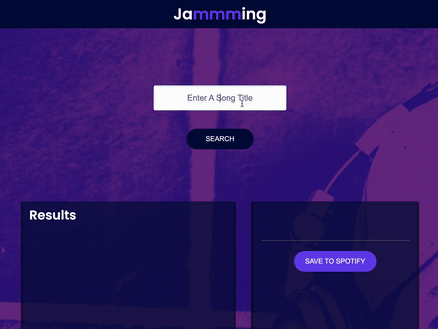

# Jamming Project

In this project, you will build a React web application called Jammming. 

### Skills in this project
You will use your knowledge of React components, passing state, and requests with the Spotify API to build a website that allows users to search the Spotify library, create a custom playlist, then save it to their Spotify account.

# Demo screen

## Project Requirements
* Build a web app using React
* Version control your application with Git and host the repository on GitHub
* Integrate with Spotify or another API
* Deploy your application

## Features:
* Users can search for songs by song title. You can also include functionality to search by other attributes like artist’s name, genre, etc.
* Users can see information about each song like title, artist, and album for songs they queried. 
* Users can export their custom playlist to their personal Spotify account
 
## License
Patrick Phuong TRAN & Codecademy

